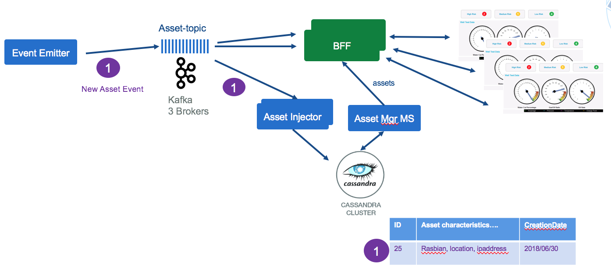

# Kafka Consumers
This project includes only a spring boot approach to Kafka consumer and producer.


### Build and run
The maven pom defines an execution id so build and run are simple:
```
$ mvn compile
$ mvn exec:java@AssetPrint
```

## Asset Injector
The `AssetInjector` class is executable as a standalone java class and its main goal is to listen to Asset events and save them into Cassandra cluster. It is using Kafka api and Cassandra API.

The AssetInjector is packaged as container (See [Dockerfile in this project](./Dockerfile) and deployable to IBM Cloud private. We have dropped this deployment for a serverless approach see [next section]()

The following diagram illustrates how the 'Asset injector' consumes `new asset event` from kafka and persists data into the cassandra `Assets` table.



For the BFF layer to Web browser real time push pattern see [the asset dashboard BFF project](../asset-dashboard-bff)

### Code Explanation
The `ibm.cte.esp.AssetInjector.java` is a POJO which uses Kafka consumer API and Cassandra persistence API. It does three things:
1. read configuration from external properties file
1. create a cassandra DAO to persist assets to cassandra
1. start a kafka consumer to get new asset event. Loop for ever.

To externalize parameters, we use the `conf/config.properties` file which will be mapped to a ConfigMap when deployed to kubernetes cluster.

For logging, as most of the APIs used ware using [slf4j](https://www.slf4j.org) and the default implementation of [logback](https://logback.qos.ch/), we added into `src/main/resource` a logback.xml configuration file to control the logging level as the DEBUG level is too low.


#### Using Kafka client API
The code is using the KafkaConsumer class and the ConsumerRecord to get the wrapper on the event. Our code implementation is exposing a `consume()`` method that is polling message every n ms.

The approach is simple:
* load properties
* create a consumer using the properties
```
kafkaConsumer = new KafkaConsumer<>(properties);
kafkaConsumer.subscribe(Arrays.asList(KAFKA_ASSET_TOPIC_NAME));
```
* expose a consume method to be used by the injector. This method poll data every n ms
```
ConsumerRecords<String, String> records = kafkaConsumer.poll(KAFKA_POLL_DURATION);
```
* the main class loop fore ever, and use the consume() method and process (save to cassandra) the n events received
```
public void run() {
  logger.info("########### Asset Injector START ##########");
      boolean runAgain = true;
      while (runAgain) {
         List<Asset> buffer = kafkaConsumer.consume();
        // commit offset only when persisted in DB.
        if (buffer.size() >= minBatchSize) {
          try {
            insertIntoDb(buffer);
            kafkaConsumer.commitOffset();
            buffer.clear();
          } catch (Exception e) {
            e.printStackTrace();
            runAgain = false;
          }
        }
      }
      kafkaConsumer.close();
}
```


## Springboot kafka consumer
We also did a second implementation by using Springboot kafka. As you can see in the `pom.xml` we are using spring boot starter, and starter-test which add libraries for Junit, and Mockito.

The consumer is packaged within container using the same open-jdk and alpine image, and can be all deployed to a kubernetes cluster like IBM Cloud Private.

See [this article](https://docs.spring.io/spring-kafka/reference/htmlsingle/#_receiving_messages) for detail on how to use springboot kafka
